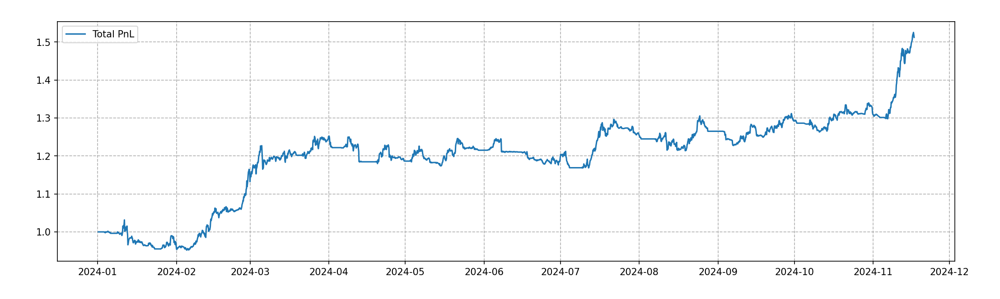

# 事件驱动回测框架

## 项目简介

本项目基于事件驱动的回测框架开发，灵感来源于 [QuantStart](https://www.quantstart.com/articles/Event-Driven-Backtesting-with-Python-Part-I/) 的系列文章。如果您对框架的原理及实现细节感兴趣，强烈建议参考原文进行学习。

## 项目进展

🎉 **2024年11月23日**，我成功实现了第一个回测盈利策略——**混合技术指标择时策略 (MixTech)**！  
该策略在 `strategy` 模块中定义为一个独立的子类，经过初步测试后，结果表现不算太差。

## 策略表现

以下为 MixTech 策略的 PnL 表现：  

---

## 后续计划

作为刚入门的新手，完成整体框架并实例化一个有效策略算一个不错的里程碑！之后打算尝试配对交易、机器学习在加密货币交易方面的应用

欢迎大家在小红书与我交流讨论！  
我的账号是 7470836993
名字是Kenneth

期待与更多志同道合的朋友一起探讨和进步！
