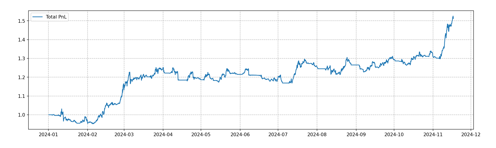

# 事件驱动回测框架

## 项目简介

本项目为事件驱动回测框架，受到 [QuantStart](https://www.quantstart.com/articles/Event-Driven-Backtesting-with-Python-Part-I/) 网站文章的启发而开发。如果您想要深入了解该框架的讲解，推荐前往原网站阅读相关内容。

## 项目进展

2024年11月23日，我成功实现了一个盈利的回测策略——**混合技术指标择时策略 (MixTech)**。  
该策略在 `strategy` 模块中以单独子类的形式定义，并完成了初步测试。

## 策略表现

以下是策略的PNL表现图：  

---
作为新手小白，这对我来说算是小小的里程碑！欢迎各位交流与指导！后期会持续更新！
